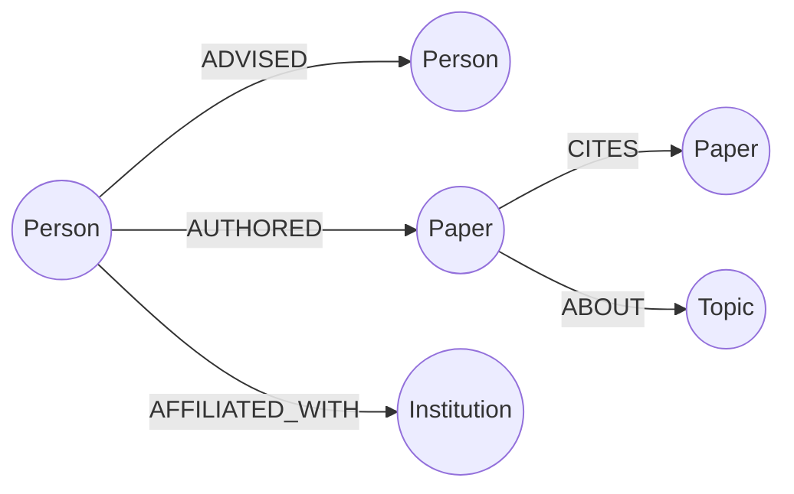

Academic Lineage & Citation Influence Explorer

An application backed by [CognoDB](https://console.cognodb.com), a managed graph database, for
exploring how ideas and mentorship propagate through academia — tracing PhD advisor lineages
and paper citation trails across researchers, papers, and institutions.

Use case

Academic influence travels along two different kinds of relationships: advising (who
trained whom, forming a tree of mentorship going back generations) and citation (which
papers build on which other papers, forming a web that often crosses labs, institutions, and
decades). This app lets you:

- Search for a researcher and see their advisor, their advisees, and their papers
- View a researcher's full academic "family tree" — every descendant reachable through
  advising relationships, at any depth
- Trace the shortest citation path between any two papers
- See which pairs of institutions cite each other's work most, across the whole dataset

Why a graph database?

Both advising lineages and citation trails are naturally arbitrary-depth path problems:
"how many advising generations separate two researchers" or "what's the shortest citation
chain between two papers" can't be answered with a fixed number of joins, because the answer
might be 1 hop or 8 hops depending on the pair. In a relational schema, this requires
recursive CTEs with no fixed bound, which are slow to write, slow to run, and get especially
awkward the moment you need to combine *two different kinds* of relationship in one query —
for example, finding citation chains that also cross institutional boundaries, which means
joining `AUTHORED`, `CITES`, and `AFFILIATED_WITH` together at an unknown depth. In Cypher,
this is a single, readable pattern match. That combination — two distinct relationship types,
walked together, at variable depth — is the single clearest case for a graph over a
relational database in this project (see Query 4 below).

## Data model

Nodes
- `Person {id, name, career_stage, start_year}`
- `Paper {id, title, year, venue}`
- `Institution {id, name, country}`
- `Topic {id, name}`

Relationships
- `(Person)-[:ADVISED {start_year}]->(Person)` — advisor → advisee
- `(Person)-[:AUTHORED]->(Paper)`
- `(Paper)-[:CITES]->(Paper)`
- `(Person)-[:AFFILIATED_WITH]->(Institution)`
- `(Paper)-[:ABOUT]->(Topic)`



Seed data (~300 people, ~800 papers, 25 institutions) is synthetic, generated with `faker`.
Citation edges are generated using a preferential attachment model rather than uniform
randomness, so a small number of papers realistically end up much more cited than most —
matching the scale-free shape of real citation networks.

Setup & run instructions

1. Create a CognoDB Cloud instance

1. Sign up at [console.cognodb.com/signup](https://console.cognodb.com/signup) (free, no
   card required).
2. Create a free `c0` instance and pick a region.
3. From the instance's **Connect** panel, copy the `bolt+s://...` URI and the generated
   password for user `cognodb` (shown once).

2. Configure environment variables

Copy `.env.example` to `.env` in the project root and fill in your real values:

```
COGNODB_URI=bolt+s://your-instance-id.databases.cognodb.cloud
COGNODB_USER=cognodb
COGNODB_PASSWORD=your-password
```

3. Set up and run the backend

```bash
python -m venv venv
venv\Scripts\activate          # Windows
source venv/bin/activate       # macOS/Linux

pip install neo4j python-dotenv fastapi "uvicorn[standard]" faker

Load seed data (one-time, safe to re-run)
python scripts/seed_data.py

Start the API
cd backend
uvicorn main:app --reload
```

The API runs at `http://127.0.0.1:8000`. Interactive docs (and a quick way to test any
endpoint by hand) are at `http://127.0.0.1:8000/docs`.

4. Set up and run the frontend

```bash
cd frontend
npm install
npm run dev
```

The app runs at `http://localhost:5173`.

Main queries, explained

**1. Full descendant lineage** (multi-hop traversal) — given a researcher, find every
academic descendant at any depth:
```cypher
MATCH (root:Person {id: $personId})-[:ADVISED*1..6]->(descendant:Person)
RETURN descendant.id AS id, descendant.name AS name
```

2. Ancestor chain — trace a researcher's advising lineage upward, and surface the
longest chain found.

3. Shortest citation path (the query a relational database would find genuinely awkward)
— find the shortest chain of citations connecting two papers, of unknown length:
```cypher
MATCH p = shortestPath((a:Paper {id: $paperIdA})-[:CITES*..10]-(b:Paper {id: $paperIdB}))
RETURN [n IN nodes(p) | n.title] AS path, length(p) AS hops
```

4. Cross-institution citation influence (the strongest "why a graph" example) — joins
two different relationship types across a variable-length hop, to find which institutions'
work most influences which others':
```cypher
MATCH (p1:Paper)<-[:AUTHORED]-(a1:Person)-[:AFFILIATED_WITH]->(i1:Institution),
      (p1)-[:CITES*1..4]->(p2:Paper)<-[:AUTHORED]-(a2:Person)-[:AFFILIATED_WITH]->(i2:Institution)
WHERE i1 <> i2
RETURN i1.name AS from_institution, i2.name AS to_institution, count(*) AS crossings
ORDER BY crossings DESC
LIMIT 20
```

5. Academic siblings — people who share the same advisor as a given researcher.

Full query implementations live in `backend/queries.py`, kept separate from the API routing
layer in `backend/main.py` so each one can be read and explained independently.


```
